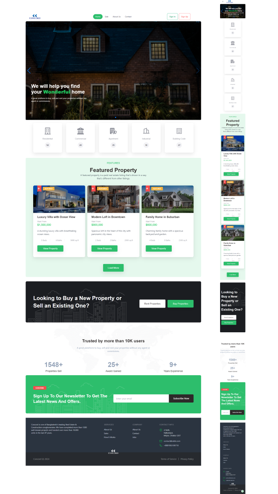

# Concord

Concord is a property listing platform that allows users to browse, 
search, and inquire about available properties. It provides a user-friendly interface 
for both property seekers and sellers, making the process of buying, selling, or renting 
properties easier and more efficient.

## Technology Used

Concord is built using the following technologies:

- **React.js:** A JavaScript library for building user interfaces, used for the frontend user interface.
- **Firebase:** A platform by Google for building web and mobile applications, utilized for user authentication and real-time database functionality. Firebase is also used for user authentication using email and password.
- **React Router:** A routing library for React applications, employed for client-side routing.
- **Tailwind CSS:** A utility-first CSS framework for quickly building custom designs, utilized for styling and layout.
- **Daisy UI:** A Tailwind CSS component library, used for some components.
- **Basic HTML, CSS:** Standard web technologies used for structuring and styling web pages.

## Packages Used

Concord utilizes the following packages:

- [Animate.css](https://animate.style/): Used for animations.
- [Swiper](https://swiperjs.com/): For sliders.
- React Hot Toast: Utilized for notifications.
- Firebase: Integrated for user authentication.
- React Router DOM: Utilized for client-side routing.

## Image Hosting Used

Concord utilizes the following image hosting:

- Imgbb

## Features

Concord offers the following features:

1. **User Authentication:** Secure user authentication system allowing users to sign up, log in, and manage their profiles.
2. **Property Listings:** Browse and search for available properties with detailed information and images.
3. **User Profiles:** Create and manage user profiles, including updating personal information and profile picture.
4. **Property Details:** View detailed information about each property listing, including price, location, and features.
5. **Responsive Design:** Fully responsive design for seamless access across various devices and screen sizes.
6. **Notifications:** Receive notifications for new property listings matching saved searches, updates on favorite properties, or messages from other users.
7. **Error Handling:** Implement robust error handling mechanisms to gracefully handle and display errors to users.
 

## About

Concord aims to simplify the process of property transactions by providing a comprehensive platform that caters to the needs of both buyers and sellers. With its intuitive interface and robust features, Concord offers a seamless experience for all users involved in the real estate market.

## Live Link

Visit [Concord](#) to explore available properties and experience the platform firsthand.

## [Click here to visit Concord Live Link Firebase Hosted](https://concord-8d229.web.app/)

## Screenshots

